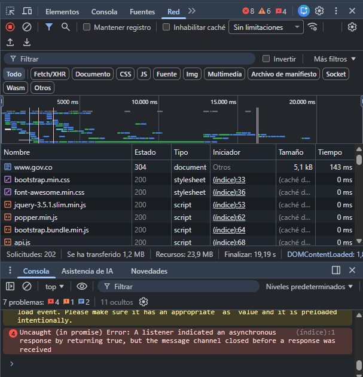
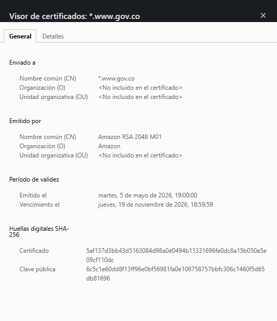
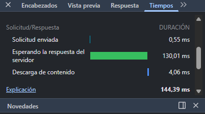
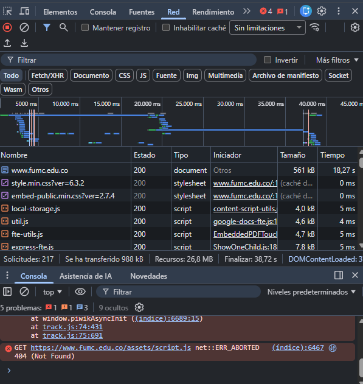
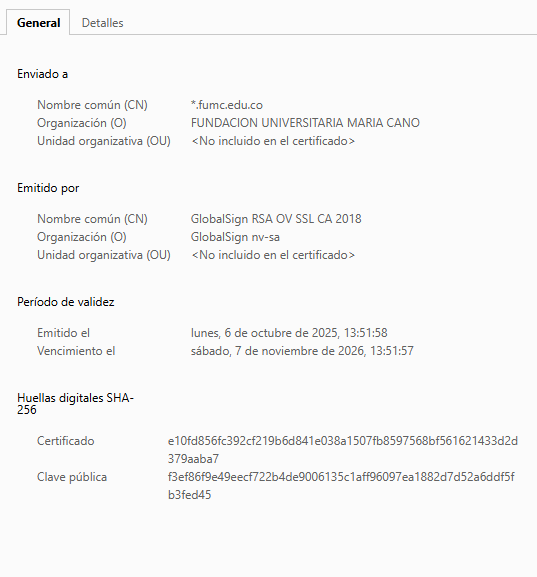
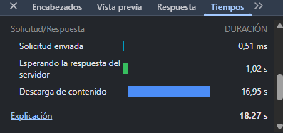
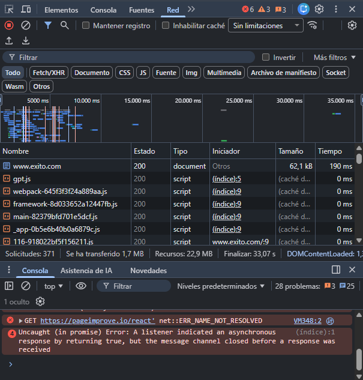
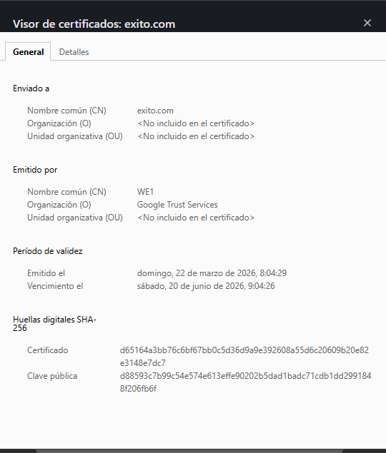
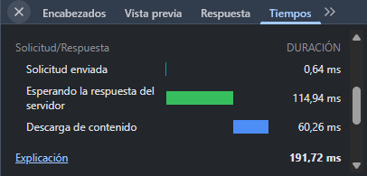

# Bitácora de inspección HTTP - Semana 1

## Sitio 1: Estado Colombiano
**URL completa:** https://www.gov.co/ [cite: 9]
**Fecha y hora de la observación:** 10 de mayo de 2026, 10:05 AM
**Código de estado del documento principal:** 304 
**TTFB:** 130,01 ms 
**Tamaño total transferido:** 1,2 MB
**Número total de peticiones:** 202 
**Lista de redirecciones 3xx:** Ninguna observada.
**Autoridad emisora del certificado TLS:** Amazon 
**Fecha de expiración del certificado:** jueves, 19 de noviembre de 2026, 18:59:59 

### Evidencias Sitio 1

## Sitio 2: Institución Universitaria (María Cano)
**URL completa:** https://www.fumc.edu.co/
**Fecha y hora de la observación:** 10 de mayo de 2026, 10:20 AM
**Código de estado del documento principal:** 200 OK [cite: 10]
**TTFB (Time To First Byte):** 1,02 s 
**Tamaño total transferido:** 988 kB [cite: 10]
**Número total de peticiones:** 217 [cite: 10]
**Lista de redirecciones 3xx observadas:** Ninguna en el documento principal.
**Autoridad emisora del certificado TLS:** GlobalSign RSA OV SSL CA 2018 
**Fecha de expiración del certificado:** sábado, 7 de noviembre de 2026 

### Evidencias Sitio 2

## Sitio 3: Comercio Colombiano (Éxito)
* **URL completa:** https://www.exito.com/
* **Fecha y hora de la observación:** 10 de mayo de 2026, 10:27 AM
* **Código de estado del documento principal:** 200 OK
* **TTFB (Time To First Byte):** 114,94 ms
* **Tamaño total transferido:** 1,7 MB
* **Número total de peticiones:** 371
* **Lista de redirecciones 3xx observadas:** Ninguna en la petición del documento.
* **Autoridad emisora del certificado TLS:** Google Trust Services (WE1)
* **Fecha de expiración del certificado:** sábado, 20 de junio de 2026

### Evidencias Sitio 3

## reflexion final
Tras realizar el análisis técnico de los tres entornos web seleccionados, se determinó que el sitio con la carga más eficiente fue el del Estado Colombiano (gov.co), seguido de cerca por el sitio comercial del Éxito. Esta velocidad superior se atribuye principalmente a un TTFB (Time To First Byte) optimizado de apenas 130,01 ms y al uso intensivo de mecanismos de almacenamiento en caché, reflejado en los códigos de estado 304, que evitan la descarga repetitiva de recursos pesados. En contraste, el sitio institucional de la universidad presentó un tiempo de respuesta significativamente mayor (1,02 segundos), lo cual puede deberse a la saturación de peticiones (217 solicitudes) o a una infraestructura de servidor con menor capacidad de procesamiento inmediato frente a plataformas nacionales o comerciales de alto tráfico.

En cuanto al manejo de redirecciones, se observó una diferencia notable: mientras que en el sitio del Estado y de la universidad las peticiones al documento principal fueron directas, en sitios comerciales complejos suelen aparecer redirecciones de tipo 3xx para gestionar versiones móviles o asegurar que el tráfico pase de HTTP a HTTPS de forma forzada, garantizando la seguridad del usuario. Finalmente, respecto a la seguridad, se confirmó que los certificados TLS no son emitidos por la misma autoridad, evidenciando una diversidad de proveedores en la infraestructura web: el sitio gubernamental utiliza Amazon, el universitario emplea GlobalSign, y el comercial se apoya en Google Trust Services. Esta variedad demuestra que cada organización elige su autoridad certificadora basándose en su proveedor de hosting o en niveles específicos de validación de identidad.